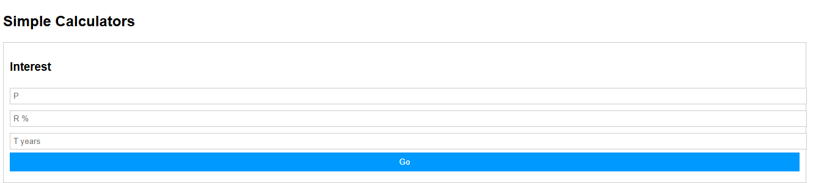
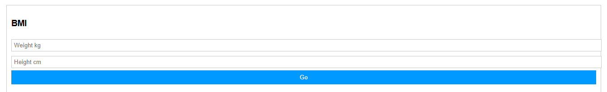
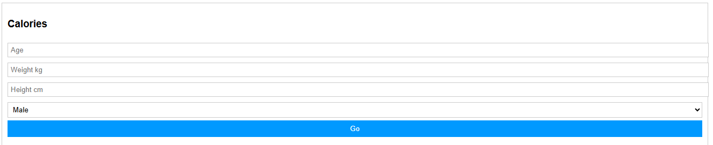

# Dynamic Calculator

A responsive web application that includes multiple useful calculators such as Interest Calculator, BMI Calculator, and Calories Calculator with dynamic input handling.

## 🚀 Live Demo
(Add your live website link here)

---

## 📸 Screenshots

### Interest Calculator

### BMI Calculator

### Calories Calculator

---

## 🛠️ Technologies Used
- HTML5
- CSS3
- JavaScript

---

## ✨ Features
- Dynamic Input Handling
- Real-Time Calculations
- Responsive Design
- User-Friendly Interface
- Multiple Calculators in One App

---

## 📂 Calculators Included
- Interest Calculator
- BMI Calculator
- Calories Calculator

---

## 👨‍💻 Author
Rohit Sahu
